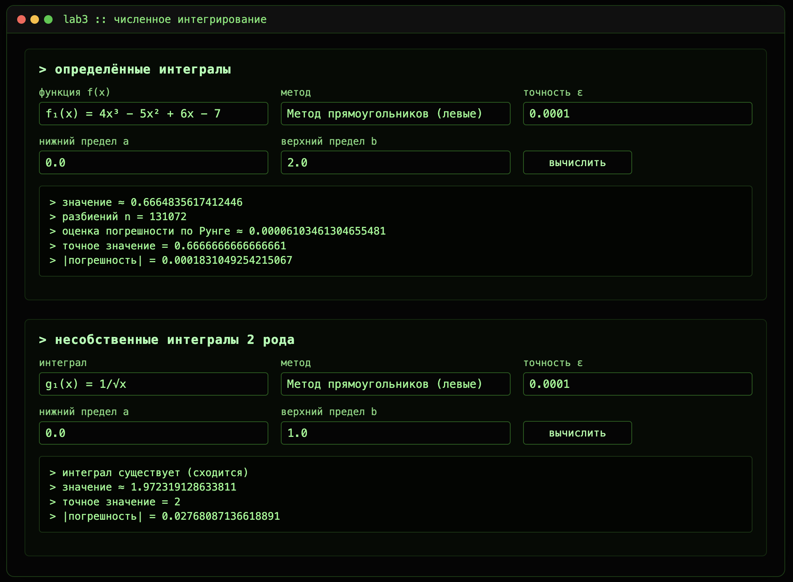

# Numeric integrations

## Установка и запуск локально

```bash
# клонировать репозиторий
git clone https://github.com/vladlenblch/numeric_integrations
cd numeric_integrations

# создать виртуальное окружение
python -m venv .venv
source .venv/bin/activate

# установить зависимости
pip install -r requirements.txt

# запустить приложение
python app.py

# открыть в браузере по адресу http://localhost:8080
```

## О проекте

Приложение позволяет вычислять интегралы двумя способами:

1. Определённые интегралы — для трёх заданных многочленов любой точности и любых границ.
2. Несобственные интегралы 2‑го рода — когда функция имеет разрыв в одной точке (в начале, в конце или внутри отрезка).

Для каждого расчёта можно выбрать метод (прямоугольники, трапеции, Симпсон) и задать требуемую точность.



## Структура проекта

- `app.py` — Flask‑сервер и API
- `numerical_methods.py` — функции для вычисления интегралов и правило Рунге
- `improper_integrals.py` — работа с несобственными интегралами и проверка сходимости
- `templates/index.html` — фронтенд
- `static/` — стили и скрипты интерфейса
- `requirements.txt` — зависимости
- `README.md` - текстовое описание проекта